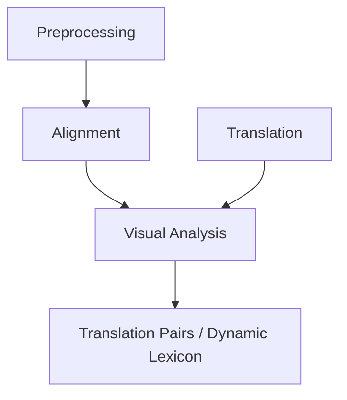

Attention Weights in Transformer NMT Fail Aligning Words Between Sequences but Largely Explain Model Predictions
https://aclanthology.org/2021.findings-emnlp.39.pdf

## A Survey of Text Alignment Visualization (2020)
https://imada.sdu.dk/u/stjaenicke/data/papers/A_Survey_of_Text_Alignment_Visualization.pdf
Relevant tasks: collation, reuse, translation (I mostly care about the last right now)
Paper is a review of interfaces
Juxta Commons / CollateX : good for interface reference, UI design

Visualization methods:
* **Sequence-aligned Heatmaps:** text:text similarity - mostly for collation
* **Grid based heatmaps:** word-word correspondence
* **Aligned barcodes:** side-by side mapping of rearrangment -- this would be good for phrase mobility
... idk, lots of good reference vis here, skipping through
> Tools such as Ugarit [101],
Linguee [3], Glosbe [1] and Reverso Context [4] provide bilingual
KeyWord-in-Context (KWIC) search functionality.

Text variant graphs - could choose rearrangements?

> doesn't say much about parse tree manipulation

I would like treebanks to have directed arrows (which word first)? but this only sort of makes sense, some languages have illinear, multibranching syntax

## Word Alignment in the Era of Deep Learning: A Tutorial (2022)
https://arxiv.org/pdf/2212.00138

- word alignment historically motivated attention
- remaining use cases: annotation projection

### SMT
Two models together - translation model and language model

$$Pr(f1, . . . , fm, a1, . . . , am|e1, . . . , em) = P r(F, a|E)$$
> where a1...am are known, makes Pr(F|E) easier?

"Essentially, word alignment decomposes the task of translating an entire sentence into translating parts of it."
* often restricted to injection, for better reasoning; two-way helps recover most of the lost info

Phrase-based MT
* MosesMT

Some manual alignments substantially improve automated alignment (are those liek, sticky points in language?)

### statistical word alignment
GIZA++
word alignment is a hidden variable

IBM model 1 -
uniform prior over alignments, alignment still useful? like, these words are likely aligned, and they likely mean each other too

IBM model 6 -
prior alignment probability - uses previous token as well as current token to predict alignment
fertility - probability that one word is equivalent to multiple words in the other language
(and a bunch of other complications)
TLDR requires a bunch of "feature engineering" - manually modeling specific details of languages

### neural machine translation
NMT: let the machine do its own feature engineering
attention is the substitute for alignment

encoder/decoder: similar but mirrored models paired
encoder takes input and produces hidden representation h^(x)
decoder takes h^(x) and previous token and produces next token
(actually, uses beam search to avoid local overfitting)
encoder-decoder paradigm compatible with many architectures: rnns, transformers...

### attention mechanism
attention ~= soft alignment: rather than binary yes or no, real-valued weightsP
encoder-decoder has the problem of fixed-length representation for all inputs - too wide for small inputs, too dense for large inputs
> "A transformer thus uses three instances of attention: source self-attention, target self-attention, and source-target attention"

### neural approaches to word alignment

### applications of word alignment

annotation projection - match tags, parts of speech between texts - very much what i'm working on!

SMT vs NMT: NMT can't use lookup tables?
"Norway for Tunisia" error - edge probabilities vs explicit token mappings

CAT (computer assisted translation)
more granular toolkit than typical translation programs
Translation memory - useful for this application (novels?) -- unsure

§7.3 seems the most valuable to me